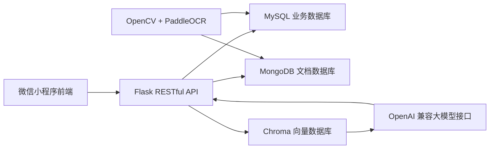
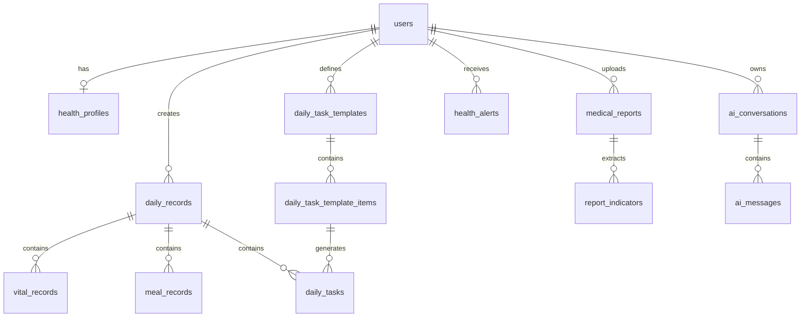

# 三高健康管理小程序数据库设计

## 1. 设计目标

本系统采用前后端分离架构，后端使用 Flask RESTful API 对外提供 JSON 接口。数据层按照数据类型拆分为三类数据库：

- MySQL：存储用户、健康档案、每日记录、饮食、血压血糖、体检指标、预警、管理员维护数据等结构化业务数据。
- MongoDB：存储 OCR 原始识别结果、体检报告解析中间结果、AI 调用日志、接口请求日志等半结构化或变化频繁的数据。
- Chroma 向量数据库：存储健康知识库、报告解读知识片段、用户健康摘要向量，用于大模型问答时的语义检索。

整体原则：

- 核心业务数据以 MySQL 为准，保证数据一致性和可查询性。
- 原始文件解析、模型响应、日志类数据放入 MongoDB，避免关系表字段过度膨胀。
- 向量库只保存用于语义检索的文本片段、向量和元数据，不作为核心业务主库。

## 2. 数据库分工

| 数据库 | 主要用途 | 典型数据 |
| --- | --- | --- |
| MySQL | 结构化业务主库 | 用户、健康档案、每日记录、血压血糖、饮食、体检指标、预警 |
| MongoDB | 半结构化过程数据 | OCR 原文、报告解析 JSON、AI 请求响应、系统操作日志 |
| Chroma | 向量检索库 | 健康知识片段、饮食建议知识、体检指标说明、用户健康摘要 |

## 3. 总体数据流



## 4. MySQL 数据库设计

数据库名建议：`three_high_health`

### 4.1 用户表 users

存储小程序用户基础登录信息。

| 字段名 | 类型 | 约束 | 说明 |
| --- | --- | --- | --- |
| id | BIGINT | PK, AUTO_INCREMENT | 用户 ID |
| openid | VARCHAR(64) | UNIQUE | 微信 openid |
| unionid | VARCHAR(64) | UNIQUE, NULL | 微信开放平台 unionid，可用于同主体跨应用关联 |
| username | VARCHAR(50) | NOT NULL | 用户名 |
| avatar_url | VARCHAR(255) | NULL | 用户头像 |
| phone | VARCHAR(20) | NULL | 手机号 |
| role | ENUM('user','admin') | DEFAULT 'user' | 用户角色 |
| status | TINYINT | DEFAULT 1 | 1 正常，0 禁用 |
| token_version | INT | NOT NULL, DEFAULT 1 | 令牌版本，退出或停用时递增 |
| last_login_at | DATETIME | NULL | 最近一次成功换取身份的时间 |
| login_count | INT | NOT NULL, DEFAULT 0 | 成功登录累计次数 |
| created_at | DATETIME | NOT NULL | 创建时间 |
| updated_at | DATETIME | NOT NULL | 更新时间 |

### 4.1.1 用户登录审计表 user_login_events

只保存排查登录问题所需的最少信息，不保存微信 `code`、AppSecret 或 `session_key`。

| 字段名 | 类型 | 约束 | 说明 |
| --- | --- | --- | --- |
| id | BIGINT | PK, AUTO_INCREMENT | 审计事件 ID |
| user_id | BIGINT | FK users.id, NULL | 成功匹配的用户；换取身份失败时为空 |
| login_method | VARCHAR(20) | NOT NULL | 登录方式，当前为 wechat |
| success | BOOLEAN | NOT NULL | 是否成功 |
| failure_code | VARCHAR(32) | NULL | 标准化失败码 |
| request_id | VARCHAR(64) | NOT NULL, INDEX | 请求追踪 ID |
| client_ip_hash | VARCHAR(64) | NOT NULL | 加盐哈希后的来源 IP，不保存明文 |
| created_at | DATETIME | NOT NULL | 事件时间 |

### 4.1.2 用户授权记录表 user_consents

每名用户只保留一条当前授权记录。服务端协议版本更新后，旧记录仍可审计，但接口会判定需要重新确认。

| 字段名 | 类型 | 约束 | 说明 |
| --- | --- | --- | --- |
| id | BIGINT | PK, AUTO_INCREMENT | 授权记录 ID |
| user_id | BIGINT | FK users.id, UNIQUE | 用户 ID |
| privacy_policy_version | VARCHAR(20) | NOT NULL | 已同意隐私政策版本 |
| user_agreement_version | VARCHAR(20) | NOT NULL | 已同意用户协议版本 |
| health_data_consent_version | VARCHAR(20) | NOT NULL | 敏感健康数据授权版本 |
| health_data_consent | BOOLEAN | NOT NULL | 是否同意处理健康数据 |
| accepted_at | DATETIME | NOT NULL | 用户确认时间 |
| withdrawn_at | DATETIME | NULL | 最近一次撤回健康数据授权的时间；重新授权后清空 |
| created_at | DATETIME | NOT NULL | 首次创建时间 |
| updated_at | DATETIME | NOT NULL | 最近更新记录时间 |

### 4.2 健康档案表 health_profiles

存储用户可编辑的健康档案。

| 字段名 | 类型 | 约束 | 说明 |
| --- | --- | --- | --- |
| id | BIGINT | PK, AUTO_INCREMENT | 档案 ID |
| user_id | BIGINT | FK users.id, UNIQUE | 用户 ID，一名用户一份档案 |
| gender | VARCHAR(10) | NULL | 性别 |
| age | INT | NULL | 年龄 |
| height_cm | DECIMAL(5,2) | NULL | 身高 cm |
| weight_kg | DECIMAL(5,2) | NULL | 体重 kg |
| bmi | DECIMAL(5,2) | NULL | BMI |
| disease_type | VARCHAR(100) | NULL | 三高类型 |
| chronic_types | JSON | NOT NULL | 结构化慢病类型代码数组 |
| medical_history | TEXT | NULL | 既往病史 |
| medication | TEXT | NULL | 当前用药 |
| created_at | DATETIME | NOT NULL | 创建时间 |
| updated_at | DATETIME | NOT NULL | 更新时间 |

### 4.3 每日记录表 daily_records

按日期聚合用户当天健康记录。

| 字段名 | 类型 | 约束 | 说明 |
| --- | --- | --- | --- |
| id | BIGINT | PK, AUTO_INCREMENT | 记录 ID |
| user_id | BIGINT | FK users.id | 用户 ID |
| record_date | DATE | NOT NULL | 记录日期 |
| completion_rate | INT | DEFAULT 0 | 完成度 |
| health_score | INT | NULL | 健康评分 |
| summary | TEXT | NULL | 今日小结 |
| created_at | DATETIME | NOT NULL | 创建时间 |
| updated_at | DATETIME | NOT NULL | 更新时间 |

建议唯一索引：`UNIQUE(user_id, record_date)`

### 4.4 血压血糖记录表 vital_records

存储每日血压、血糖、体重等核心指标。

| 字段名 | 类型 | 约束 | 说明 |
| --- | --- | --- | --- |
| id | BIGINT | PK, AUTO_INCREMENT | 指标记录 ID |
| daily_record_id | BIGINT | FK daily_records.id, UNIQUE | 每日记录 ID，每日最多一条体征汇总 |
| user_id | BIGINT | FK users.id | 用户 ID |
| systolic_pressure | INT | NULL | 收缩压 mmHg |
| diastolic_pressure | INT | NULL | 舒张压 mmHg |
| fasting_glucose | DECIMAL(4,1) | NULL | 空腹血糖 mmol/L |
| postprandial_glucose | DECIMAL(4,1) | NULL | 餐后血糖 mmol/L |
| weight_kg | DECIMAL(5,2) | NULL | 体重 kg |
| measured_at | DATETIME | NULL | 测量时间 |
| remark | VARCHAR(255) | NULL | 备注 |
| created_at | DATETIME | NOT NULL | 创建时间 |

### 4.5 饮食记录表 meal_records

存储每日三餐记录。

| 字段名 | 类型 | 约束 | 说明 |
| --- | --- | --- | --- |
| id | BIGINT | PK, AUTO_INCREMENT | 饮食记录 ID |
| daily_record_id | BIGINT | FK daily_records.id | 每日记录 ID |
| user_id | BIGINT | FK users.id | 用户 ID |
| meal_type | ENUM('breakfast','lunch','dinner','extra') | NOT NULL | 餐次 |
| meal_name | VARCHAR(30) | NOT NULL, DEFAULT '加餐' | 餐次展示名称 |
| food_text | TEXT | NOT NULL | 食物描述 |
| calories | DECIMAL(8,2) | NULL | 热量 kcal |
| sugar_g | DECIMAL(8,2) | NULL | 糖分 g |
| fat_g | DECIMAL(8,2) | NULL | 脂肪 g |
| salt_g | DECIMAL(8,2) | NULL | 盐分 g |
| advice | TEXT | NULL | 饮食建议 |
| created_at | DATETIME | NOT NULL | 创建时间 |
| updated_at | DATETIME | NOT NULL | 更新时间 |

### 4.6 食物营养库表 food_items

管理员维护基础食物营养数据。

| 字段名 | 类型 | 约束 | 说明 |
| --- | --- | --- | --- |
| id | BIGINT | PK, AUTO_INCREMENT | 食物 ID |
| name | VARCHAR(100) | NOT NULL | 食物名称 |
| category | VARCHAR(50) | NULL | 分类 |
| calories_per_100g | DECIMAL(8,2) | NULL | 每 100g 热量 |
| sugar_per_100g | DECIMAL(8,2) | NULL | 每 100g 糖分 |
| fat_per_100g | DECIMAL(8,2) | NULL | 每 100g 脂肪 |
| salt_per_100g | DECIMAL(8,2) | NULL | 每 100g 盐分 |
| suitable_tags | VARCHAR(255) | NULL | 适合标签 |
| avoid_tags | VARCHAR(255) | NULL | 慎用标签 |
| created_at | DATETIME | NOT NULL | 创建时间 |
| updated_at | DATETIME | NOT NULL | 更新时间 |

### 4.7 体检报告表 medical_reports

存储用户上传报告的业务状态。

| 字段名 | 类型 | 约束 | 说明 |
| --- | --- | --- | --- |
| id | BIGINT | PK, AUTO_INCREMENT | 报告 ID |
| user_id | BIGINT | FK users.id | 用户 ID |
| file_name | VARCHAR(255) | NOT NULL | 文件名 |
| file_type | ENUM('image','pdf') | NOT NULL | 文件类型 |
| file_url | VARCHAR(255) | NULL | 文件存储路径 |
| source | VARCHAR(30) | NOT NULL | 上传来源 |
| report_date | DATE | NOT NULL | 报告日期 |
| ocr_doc_id | VARCHAR(64) | NULL | MongoDB OCR 文档 ID |
| status | ENUM('uploaded','recognizing','extracting','recognized','review_pending','completed','rejected','failed','archived') | DEFAULT 'uploaded' | 报告状态 |
| confidence | DECIMAL(5,2) | NULL | OCR 置信度 |
| progress | INT | NOT NULL, DEFAULT 0 | 处理进度 |
| summary | TEXT | NULL | 报告摘要 |
| review_note | TEXT | NULL | 审核备注 |
| uploaded_at | DATETIME | NOT NULL | 上传时间 |
| reviewed_by | BIGINT | NULL | 审核管理员 ID |
| reviewed_at | DATETIME | NULL | 审核时间 |

### 4.8 体检指标表 report_indicators

存储 OCR 提取后的结构化指标。

| 字段名 | 类型 | 约束 | 说明 |
| --- | --- | --- | --- |
| id | BIGINT | PK, AUTO_INCREMENT | 指标 ID |
| report_id | BIGINT | FK medical_reports.id | 报告 ID |
| user_id | BIGINT | FK users.id | 用户 ID |
| alert_type | VARCHAR(30) | NOT NULL | 预警业务类型 |
| record_date | DATE | NOT NULL | 所属日期 |
| indicator_name | VARCHAR(100) | NOT NULL | 指标名称 |
| indicator_code | VARCHAR(50) | NULL | 指标编码 |
| value | VARCHAR(50) | NOT NULL | 指标值 |
| unit | VARCHAR(30) | NULL | 单位 |
| reference_range | VARCHAR(100) | NULL | 参考范围 |
| result_status | ENUM('normal','high','low','abnormal') | NOT NULL | 判断结果 |
| risk_level | ENUM('low','medium','high') | DEFAULT 'low' | 风险等级 |
| created_at | DATETIME | NOT NULL | 创建时间 |

### 4.9 异常预警表 health_alerts

存储异常指标和系统提醒。

| 字段名 | 类型 | 约束 | 说明 |
| --- | --- | --- | --- |
| id | BIGINT | PK, AUTO_INCREMENT | 预警 ID |
| user_id | BIGINT | FK users.id | 用户 ID |
| source_type | ENUM('vital','diet','report','prediction') | NOT NULL | 来源类型 |
| source_id | BIGINT | NULL | 来源记录 ID |
| title | VARCHAR(100) | NOT NULL | 预警标题 |
| content | TEXT | NOT NULL | 预警内容 |
| description | TEXT | NOT NULL | 面向用户的详细说明 |
| risk_level | ENUM('low','medium','high') | NOT NULL | 风险等级 |
| is_read | TINYINT | DEFAULT 0 | 是否已读 |
| created_at | DATETIME | NOT NULL | 创建时间 |

### 4.10 待办模板版本表 daily_task_templates

存储用户“每日待办”的版本规则。用户每次修改待办内容时，不直接覆盖历史待办，而是生成一个新的模板版本。旧模板的 `effective_to` 截止到新模板生效日期前一天，新模板从 `effective_from` 开始延续使用，直到下一次修改。

业务规则：

- 每天 24:00，即次日 00:00，根据当前生效模板生成当天的 `daily_tasks` 快照。
- 用户在某一天修改待办后，从修改日期开始生成新模板版本。
- 修改日期之前已经生成的 `daily_tasks` 不变，保证历史记录可追溯。
- 后续日期继续沿用最新模板，直到用户下一次修改待办。

示例：

| 时间 | 用户操作 | 生效结果 |
| --- | --- | --- |
| 2026-08-01 | 设置待办 A、B、C | 模板 V1 从 2026-08-01 生效 |
| 2026-08-10 | 每天 00:00 自动生成 | 8 月 1 日到 8 月 10 日使用 V1 快照 |
| 2026-08-18 | 用户修改为 A、B、D | 模板 V1 截止到 2026-08-17，模板 V2 从 2026-08-18 生效 |
| 2026-08-19 | 自动生成当天待办 | 使用 V2，不影响 8 月 18 日之前的数据 |

| 字段名 | 类型 | 约束 | 说明 |
| --- | --- | --- | --- |
| id | BIGINT | PK, AUTO_INCREMENT | 模板版本 ID |
| user_id | BIGINT | FK users.id | 用户 ID |
| version_no | INT | NOT NULL | 模板版本号 |
| effective_from | DATE | NOT NULL | 生效开始日期 |
| effective_to | DATE | NULL | 生效结束日期，NULL 表示当前版本 |
| is_active | TINYINT | DEFAULT 1 | 是否当前启用 |
| created_at | DATETIME | NOT NULL | 创建时间 |
| updated_at | DATETIME | NOT NULL | 更新时间 |

### 4.11 待办模板明细表 daily_task_template_items

存储某个模板版本下包含哪些待办事项。

| 字段名 | 类型 | 约束 | 说明 |
| --- | --- | --- | --- |
| id | BIGINT | PK, AUTO_INCREMENT | 模板明细 ID |
| template_id | BIGINT | FK daily_task_templates.id | 所属模板版本 ID |
| task_name | VARCHAR(100) | NOT NULL | 待办名称 |
| sort_order | INT | DEFAULT 0 | 排序 |
| is_required | TINYINT | DEFAULT 1 | 是否默认显示 |
| created_at | DATETIME | NOT NULL | 创建时间 |

### 4.12 每日待办快照表 daily_tasks

存储当天表单里的待办快照和完成状态。该表表示“某一天实际出现的待办”，不是长期模板；因此用户修改模板后，历史日期的 `daily_tasks` 不会被覆盖。

| 字段名 | 类型 | 约束 | 说明 |
| --- | --- | --- | --- |
| id | BIGINT | PK, AUTO_INCREMENT | 待办快照 ID |
| daily_record_id | BIGINT | FK daily_records.id | 每日记录 ID |
| user_id | BIGINT | FK users.id | 用户 ID |
| record_date | DATE | NOT NULL | 所属日期 |
| template_id | BIGINT | FK daily_task_templates.id | 来源模板版本 ID |
| template_item_id | BIGINT | FK daily_task_template_items.id | 来源模板明细 ID |
| task_name_snapshot | VARCHAR(100) | NOT NULL | 当天待办名称快照 |
| is_done | TINYINT | DEFAULT 0 | 是否完成 |
| completed_at | DATETIME | NULL | 完成时间 |
| sort_order | INT | DEFAULT 0 | 排序 |
| created_at | DATETIME | NOT NULL | 创建时间 |
| updated_at | DATETIME | NOT NULL | 更新时间 |

待办生成与更新流程：

1. 用户第一次使用系统时，创建模板 V1，并写入 `daily_task_template_items`。
2. 每天 24:00，即次日 00:00，系统查询该用户当前有效模板，将模板明细复制为新一天的 `daily_tasks`。
3. 用户只勾选完成状态时，只更新当天 `daily_tasks.is_done`，不影响模板。
4. 用户修改待办内容时，例如新增、删除或改名，系统创建模板 V2。
5. V1 的 `effective_to` 更新为修改日期前一天，V2 的 `effective_from` 设置为修改日期。
6. 如果修改日当天已经生成过 `daily_tasks`，则只重建修改日当天快照；同名待办尽量保留完成状态，新增待办默认为未完成，删除的待办从当天表单移除。
7. 修改日期之前的 `daily_tasks` 保持不变；修改日期及之后生成的待办使用 V2。

### 4.13 AI 对话表 ai_conversations

存储对话会话。

| 字段名 | 类型 | 约束 | 说明 |
| --- | --- | --- | --- |
| id | BIGINT | PK, AUTO_INCREMENT | 会话 ID |
| user_id | BIGINT | FK users.id | 用户 ID |
| title | VARCHAR(100) | NULL | 会话标题 |
| source | VARCHAR(30) | NOT NULL | 会话来源 |
| related_date | DATE | NULL | 关联健康记录日期 |
| summary | TEXT | NULL | 会话摘要 |
| created_at | DATETIME | NOT NULL | 创建时间 |
| updated_at | DATETIME | NOT NULL | 更新时间 |

### 4.14 AI 消息表 ai_messages

存储对话消息。

| 字段名 | 类型 | 约束 | 说明 |
| --- | --- | --- | --- |
| id | BIGINT | PK, AUTO_INCREMENT | 消息 ID |
| conversation_id | BIGINT | FK ai_conversations.id | 会话 ID |
| user_id | BIGINT | FK users.id | 用户 ID |
| role | ENUM('user','assistant','system') | NOT NULL | 消息角色 |
| content | TEXT | NOT NULL | 消息内容 |
| mongo_trace_id | VARCHAR(64) | NULL | MongoDB 调用日志 ID |
| created_at | DATETIME | NOT NULL | 创建时间 |

### 4.15 系统公告表 announcements

管理员发布系统公告。

| 字段名 | 类型 | 约束 | 说明 |
| --- | --- | --- | --- |
| id | BIGINT | PK, AUTO_INCREMENT | 公告 ID |
| title | VARCHAR(100) | NOT NULL | 标题 |
| content | TEXT | NOT NULL | 内容 |
| publish_status | ENUM('draft','published','offline') | DEFAULT 'draft' | 发布状态 |
| created_by | BIGINT | FK users.id | 管理员 ID |
| created_at | DATETIME | NOT NULL | 创建时间 |
| updated_at | DATETIME | NOT NULL | 更新时间 |

## 5. MySQL 关系说明



## 6. MongoDB 数据结构设计

数据库名建议：`three_high_health_docs`

MongoDB 用于保存结构不稳定、字段变化多、体积较大的文档数据。

### 6.1 OCR 原始结果集合 ocr_results

用途：保存 PaddleOCR 对图片或 PDF 的原始识别内容、位置坐标和解析过程。

示例文档：

```json
{
  "_id": "ocr_20260818_000001",
  "report_id": 10001,
  "user_id": 1,
  "file_name": "体检报告.jpg",
  "file_type": "image",
  "status": "recognized",
  "confidence": 0.92,
  "raw_text": "空腹血糖 6.8 mmol/L 总胆固醇 5.9 mmol/L ...",
  "blocks": [
    {
      "text": "空腹血糖",
      "value": "6.8",
      "unit": "mmol/L",
      "bbox": [120, 340, 280, 372],
      "confidence": 0.95
    }
  ],
  "parsed_indicators": [
    {
      "name": "空腹血糖",
      "value": "6.8",
      "unit": "mmol/L",
      "reference_range": "3.9-6.1",
      "status": "high"
    }
  ],
  "created_at": "2026-08-18T10:20:00+08:00"
}
```

建议索引：

- `report_id`
- `user_id`
- `created_at`
- `status`

### 6.2 AI 调用日志集合 ai_call_logs

用途：保存大模型调用的 prompt、检索上下文、响应和耗时，便于调试。

示例文档：

```json
{
  "_id": "ai_log_20260818_000001",
  "conversation_id": 20001,
  "message_id": 30001,
  "user_id": 1,
  "model": "openai-compatible-chat-model",
  "prompt_template": "daily_health_advice_v1",
  "user_question": "最近空腹血糖偏高，晚饭应该怎么吃？",
  "retrieved_chunks": [
    {
      "collection": "health_knowledge",
      "chunk_id": "diet_diabetes_001",
      "score": 0.86
    }
  ],
  "request_payload": {
    "temperature": 0.3,
    "max_tokens": 800
  },
  "response_text": "晚餐主食建议控制在半碗左右...",
  "latency_ms": 1280,
  "created_at": "2026-08-18T10:25:00+08:00"
}
```

建议索引：

- `conversation_id`
- `message_id`
- `user_id`
- `created_at`

### 6.3 接口请求日志集合 api_request_logs

用途：记录接口访问日志，便于测试和排查问题。

示例文档：

```json
{
  "_id": "api_log_20260818_000001",
  "request_id": "req_abc123",
  "user_id": 1,
  "method": "POST",
  "path": "/api/v1/reports/ocr",
  "status_code": 200,
  "duration_ms": 320,
  "client_ip": "127.0.0.1",
  "user_agent": "WeChat MiniProgram",
  "created_at": "2026-08-18T10:30:00+08:00"
}
```

建议索引：

- `request_id`
- `user_id`
- `path`
- `status_code`
- `created_at`

### 6.4 预测结果快照集合 prediction_snapshots

用途：保存机器学习模型每次预测的输入、输出和模型版本。

示例文档：

```json
{
  "_id": "pred_20260818_000001",
  "user_id": 1,
  "model_name": "bp_glucose_trend_model",
  "model_version": "v1.0",
  "input_window": {
    "start_date": "2026-08-11",
    "end_date": "2026-08-17"
  },
  "features": {
    "avg_systolic": 136,
    "avg_fasting_glucose": 6.6,
    "avg_salt_g": 4.6
  },
  "predictions": [
    {
      "date": "2026-08-18",
      "bp": "136/84",
      "fasting_glucose": 6.5,
      "risk_level": "medium"
    }
  ],
  "created_at": "2026-08-18T10:35:00+08:00"
}
```

建议索引：

- `user_id`
- `model_name`
- `model_version`
- `created_at`

## 7. Chroma 向量数据库设计

Chroma 用于大模型问答前的语义检索，建议本地目录：

```text
backend/storage/chroma
```

### 7.1 集合 health_knowledge

用途：存储三高健康管理知识、饮食原则、指标解释、运动建议。

| 字段 | 说明 |
| --- | --- |
| id | 知识片段唯一 ID |
| document | 分块后的知识文本 |
| embedding | 文本向量 |
| metadata.source | 来源，如 guideline、diet_rule、indicator_reference |
| metadata.category | 分类，如 血压、血糖、血脂、饮食、运动 |
| metadata.disease_type | 适用人群，如 hypertension、diabetes、hyperlipidemia |
| metadata.risk_level | 适用风险等级 |
| metadata.updated_at | 更新时间 |

示例：

```json
{
  "id": "diet_diabetes_001",
  "document": "空腹血糖偏高人群晚餐应减少精制主食，优先选择全谷物、豆制品和深色蔬菜。",
  "metadata": {
    "source": "diet_rule",
    "category": "饮食",
    "disease_type": "diabetes",
    "risk_level": "medium",
    "updated_at": "2026-08-18"
  }
}
```

### 7.2 集合 indicator_reference

用途：存储体检指标解释、参考范围、异常含义和建议。

| 字段 | 说明 |
| --- | --- |
| id | 指标知识 ID |
| document | 指标解释文本 |
| embedding | 文本向量 |
| metadata.indicator_code | 指标编码 |
| metadata.indicator_name | 指标名称 |
| metadata.unit | 单位 |
| metadata.normal_range | 常见参考范围 |
| metadata.category | 指标分类 |

示例：

```json
{
  "id": "indicator_fbg_001",
  "document": "空腹血糖用于评估血糖控制情况，偏高时应结合饮食、运动、用药和复查情况综合判断。",
  "metadata": {
    "indicator_code": "FBG",
    "indicator_name": "空腹血糖",
    "unit": "mmol/L",
    "normal_range": "3.9-6.1",
    "category": "血糖"
  }
}
```

### 7.3 集合 user_health_memory

用途：存储用户健康摘要向量，帮助 AI 回答时结合用户历史情况。

| 字段 | 说明 |
| --- | --- |
| id | 用户摘要 ID |
| document | 用户健康摘要文本 |
| embedding | 文本向量 |
| metadata.user_id | 用户 ID |
| metadata.record_date | 摘要日期 |
| metadata.source_type | daily_record、report、conversation |
| metadata.risk_level | 风险等级 |

示例：

```json
{
  "id": "user_1_daily_20260818",
  "document": "用户李明，56岁，近期空腹血糖 6.8 mmol/L，收缩压 138 mmHg，晚餐主食摄入偏多。",
  "metadata": {
    "user_id": 1,
    "record_date": "2026-08-18",
    "source_type": "daily_record",
    "risk_level": "medium"
  }
}
```

## 8. 推荐建表 SQL

以下 SQL 可作为后端初始化数据库的基础版本：

```sql
CREATE DATABASE IF NOT EXISTS three_high_health
  DEFAULT CHARACTER SET utf8mb4
  DEFAULT COLLATE utf8mb4_unicode_ci;

USE three_high_health;

CREATE TABLE users (
  id BIGINT PRIMARY KEY AUTO_INCREMENT,
  openid VARCHAR(64) UNIQUE,
  unionid VARCHAR(64) UNIQUE,
  username VARCHAR(50) NOT NULL,
  avatar_url VARCHAR(255),
  phone VARCHAR(20),
  role ENUM('user','admin') DEFAULT 'user',
  status TINYINT DEFAULT 1,
  token_version INT NOT NULL DEFAULT 1,
  last_login_at DATETIME,
  login_count INT NOT NULL DEFAULT 0,
  created_at DATETIME NOT NULL,
  updated_at DATETIME NOT NULL
);

CREATE TABLE user_login_events (
  id BIGINT PRIMARY KEY AUTO_INCREMENT,
  user_id BIGINT,
  login_method VARCHAR(20) NOT NULL,
  success BOOLEAN NOT NULL,
  failure_code VARCHAR(32),
  request_id VARCHAR(64) NOT NULL,
  client_ip_hash VARCHAR(64) NOT NULL,
  created_at DATETIME NOT NULL,
  INDEX ix_user_login_events_user_created (user_id, created_at),
  INDEX ix_user_login_events_request_id (request_id),
  CONSTRAINT fk_user_login_events_user FOREIGN KEY (user_id) REFERENCES users(id)
);

CREATE TABLE user_consents (
  id BIGINT PRIMARY KEY AUTO_INCREMENT,
  user_id BIGINT NOT NULL,
  privacy_policy_version VARCHAR(20) NOT NULL,
  user_agreement_version VARCHAR(20) NOT NULL,
  health_data_consent_version VARCHAR(20) NOT NULL,
  health_data_consent BOOLEAN NOT NULL,
  accepted_at DATETIME NOT NULL,
  withdrawn_at DATETIME NULL,
  created_at DATETIME NOT NULL,
  updated_at DATETIME NOT NULL,
  CONSTRAINT uq_user_consents_user UNIQUE (user_id),
  CONSTRAINT fk_user_consents_user FOREIGN KEY (user_id) REFERENCES users(id)
);

CREATE TABLE health_profiles (
  id BIGINT PRIMARY KEY AUTO_INCREMENT,
  user_id BIGINT NOT NULL,
  gender VARCHAR(10),
  age INT,
  height_cm DECIMAL(5,2),
  weight_kg DECIMAL(5,2),
  bmi DECIMAL(5,2),
  disease_type VARCHAR(100),
  chronic_types JSON NOT NULL,
  medical_history TEXT,
  medication TEXT,
  family_doctor VARCHAR(80),
  created_at DATETIME NOT NULL,
  updated_at DATETIME NOT NULL,
  CONSTRAINT fk_health_profiles_user FOREIGN KEY (user_id) REFERENCES users(id),
  CONSTRAINT uk_health_profile_user UNIQUE (user_id)
);

CREATE TABLE daily_records (
  id BIGINT PRIMARY KEY AUTO_INCREMENT,
  user_id BIGINT NOT NULL,
  record_date DATE NOT NULL,
  completion_rate INT DEFAULT 0,
  health_score INT,
  summary TEXT,
  created_at DATETIME NOT NULL,
  updated_at DATETIME NOT NULL,
  UNIQUE KEY uk_daily_user_date (user_id, record_date),
  CONSTRAINT fk_daily_records_user FOREIGN KEY (user_id) REFERENCES users(id)
);

CREATE TABLE vital_records (
  id BIGINT PRIMARY KEY AUTO_INCREMENT,
  daily_record_id BIGINT NOT NULL,
  user_id BIGINT NOT NULL,
  systolic_pressure INT,
  diastolic_pressure INT,
  fasting_glucose DECIMAL(4,1),
  postprandial_glucose DECIMAL(4,1),
  weight_kg DECIMAL(5,2),
  measured_at DATETIME,
  remark VARCHAR(255),
  created_at DATETIME NOT NULL,
  KEY idx_vital_user_time (user_id, measured_at),
  CONSTRAINT fk_vital_daily FOREIGN KEY (daily_record_id) REFERENCES daily_records(id),
  CONSTRAINT fk_vital_user FOREIGN KEY (user_id) REFERENCES users(id),
  CONSTRAINT uk_vital_daily_record UNIQUE (daily_record_id)
);

CREATE TABLE meal_records (
  id BIGINT PRIMARY KEY AUTO_INCREMENT,
  daily_record_id BIGINT NOT NULL,
  user_id BIGINT NOT NULL,
  meal_type ENUM('breakfast','lunch','dinner','extra') NOT NULL,
  meal_name VARCHAR(30) NOT NULL DEFAULT '加餐',
  food_text TEXT NOT NULL,
  calories DECIMAL(8,2),
  sugar_g DECIMAL(8,2),
  fat_g DECIMAL(8,2),
  salt_g DECIMAL(8,2),
  advice TEXT,
  created_at DATETIME NOT NULL,
  updated_at DATETIME NOT NULL,
  KEY idx_meal_user_daily (user_id, daily_record_id),
  CONSTRAINT fk_meal_daily FOREIGN KEY (daily_record_id) REFERENCES daily_records(id),
  CONSTRAINT fk_meal_user FOREIGN KEY (user_id) REFERENCES users(id)
);

CREATE TABLE food_items (
  id BIGINT PRIMARY KEY AUTO_INCREMENT,
  name VARCHAR(100) NOT NULL,
  category VARCHAR(50),
  calories_per_100g DECIMAL(8,2),
  sugar_per_100g DECIMAL(8,2),
  fat_per_100g DECIMAL(8,2),
  salt_per_100g DECIMAL(8,2),
  suitable_tags VARCHAR(255),
  avoid_tags VARCHAR(255),
  created_at DATETIME NOT NULL,
  updated_at DATETIME NOT NULL
);

CREATE TABLE medical_reports (
  id BIGINT PRIMARY KEY AUTO_INCREMENT,
  user_id BIGINT NOT NULL,
  file_name VARCHAR(255) NOT NULL,
  file_type ENUM('image','pdf') NOT NULL,
  file_url VARCHAR(255),
  source VARCHAR(30) NOT NULL DEFAULT 'manual',
  report_date DATE NOT NULL,
  ocr_doc_id VARCHAR(64),
  status ENUM('uploaded','recognizing','extracting','recognized','review_pending','completed','rejected','failed','archived') DEFAULT 'uploaded',
  confidence DECIMAL(5,2),
  progress INT NOT NULL DEFAULT 0,
  summary TEXT,
  review_note TEXT,
  uploaded_at DATETIME NOT NULL,
  reviewed_by BIGINT,
  reviewed_at DATETIME,
  KEY idx_report_user_time (user_id, uploaded_at),
  CONSTRAINT fk_report_user FOREIGN KEY (user_id) REFERENCES users(id),
  CONSTRAINT fk_report_reviewer FOREIGN KEY (reviewed_by) REFERENCES users(id)
);

CREATE TABLE report_indicators (
  id BIGINT PRIMARY KEY AUTO_INCREMENT,
  report_id BIGINT NOT NULL,
  user_id BIGINT NOT NULL,
  alert_type VARCHAR(30) NOT NULL,
  record_date DATE NOT NULL,
  indicator_name VARCHAR(100) NOT NULL,
  indicator_code VARCHAR(50),
  value VARCHAR(50) NOT NULL,
  unit VARCHAR(30),
  reference_range VARCHAR(100),
  result_status ENUM('normal','high','low','abnormal') NOT NULL,
  risk_level ENUM('low','medium','high') DEFAULT 'low',
  created_at DATETIME NOT NULL,
  KEY idx_indicator_user_name (user_id, indicator_name),
  CONSTRAINT fk_indicator_report FOREIGN KEY (report_id) REFERENCES medical_reports(id),
  CONSTRAINT fk_indicator_user FOREIGN KEY (user_id) REFERENCES users(id)
);

CREATE TABLE health_alerts (
  id BIGINT PRIMARY KEY AUTO_INCREMENT,
  user_id BIGINT NOT NULL,
  source_type ENUM('vital','diet','report','prediction') NOT NULL,
  source_id BIGINT,
  title VARCHAR(100) NOT NULL,
  content TEXT NOT NULL,
  description TEXT NOT NULL,
  risk_level ENUM('low','medium','high') NOT NULL,
  is_read TINYINT DEFAULT 0,
  created_at DATETIME NOT NULL,
  KEY idx_alert_user_read (user_id, is_read),
  CONSTRAINT fk_alert_user FOREIGN KEY (user_id) REFERENCES users(id)
);

CREATE TABLE daily_task_templates (
  id BIGINT PRIMARY KEY AUTO_INCREMENT,
  user_id BIGINT NOT NULL,
  version_no INT NOT NULL,
  effective_from DATE NOT NULL,
  effective_to DATE,
  is_active TINYINT DEFAULT 1,
  created_at DATETIME NOT NULL,
  updated_at DATETIME NOT NULL,
  UNIQUE KEY uk_task_template_user_version (user_id, version_no),
  KEY idx_task_template_user_effective (user_id, effective_from, effective_to),
  CONSTRAINT fk_task_template_user FOREIGN KEY (user_id) REFERENCES users(id)
);

CREATE TABLE daily_task_template_items (
  id BIGINT PRIMARY KEY AUTO_INCREMENT,
  template_id BIGINT NOT NULL,
  task_name VARCHAR(100) NOT NULL,
  sort_order INT DEFAULT 0,
  is_required TINYINT DEFAULT 1,
  created_at DATETIME NOT NULL,
  KEY idx_task_template_item_template (template_id, sort_order),
  CONSTRAINT fk_task_template_item_template FOREIGN KEY (template_id) REFERENCES daily_task_templates(id)
);

CREATE TABLE daily_tasks (
  id BIGINT PRIMARY KEY AUTO_INCREMENT,
  daily_record_id BIGINT NOT NULL,
  user_id BIGINT NOT NULL,
  record_date DATE NOT NULL,
  template_id BIGINT NOT NULL,
  template_item_id BIGINT NOT NULL,
  task_name_snapshot VARCHAR(100) NOT NULL,
  is_done TINYINT DEFAULT 0,
  completed_at DATETIME,
  sort_order INT DEFAULT 0,
  created_at DATETIME NOT NULL,
  updated_at DATETIME NOT NULL,
  UNIQUE KEY uk_daily_task_item (daily_record_id, template_item_id),
  KEY idx_daily_task_user_date (user_id, record_date),
  CONSTRAINT fk_task_daily FOREIGN KEY (daily_record_id) REFERENCES daily_records(id),
  CONSTRAINT fk_task_user FOREIGN KEY (user_id) REFERENCES users(id),
  CONSTRAINT fk_task_template FOREIGN KEY (template_id) REFERENCES daily_task_templates(id),
  CONSTRAINT fk_task_template_item FOREIGN KEY (template_item_id) REFERENCES daily_task_template_items(id)
);

CREATE TABLE ai_conversations (
  id BIGINT PRIMARY KEY AUTO_INCREMENT,
  user_id BIGINT NOT NULL,
  title VARCHAR(100),
  source VARCHAR(30) NOT NULL DEFAULT 'manual',
  related_date DATE,
  summary TEXT,
  created_at DATETIME NOT NULL,
  updated_at DATETIME NOT NULL,
  KEY idx_ai_conversation_user (user_id, updated_at),
  CONSTRAINT fk_ai_conversation_user FOREIGN KEY (user_id) REFERENCES users(id)
);

CREATE TABLE ai_messages (
  id BIGINT PRIMARY KEY AUTO_INCREMENT,
  conversation_id BIGINT NOT NULL,
  user_id BIGINT NOT NULL,
  role ENUM('user','assistant','system') NOT NULL,
  content TEXT NOT NULL,
  mongo_trace_id VARCHAR(64),
  created_at DATETIME NOT NULL,
  KEY idx_ai_message_conversation (conversation_id, created_at),
  CONSTRAINT fk_ai_message_conversation FOREIGN KEY (conversation_id) REFERENCES ai_conversations(id),
  CONSTRAINT fk_ai_message_user FOREIGN KEY (user_id) REFERENCES users(id)
);

CREATE TABLE announcements (
  id BIGINT PRIMARY KEY AUTO_INCREMENT,
  title VARCHAR(100) NOT NULL,
  content TEXT NOT NULL,
  publish_status ENUM('draft','published','offline') DEFAULT 'draft',
  created_by BIGINT NOT NULL,
  created_at DATETIME NOT NULL,
  updated_at DATETIME NOT NULL,
  CONSTRAINT fk_announcement_creator FOREIGN KEY (created_by) REFERENCES users(id)
);
```

## 9. 后端目录建议

数据库相关代码建议放在以下目录中：

```text
backend/
  app/
    models/                 # SQLAlchemy 模型
      user.py
      health_profile.py
      daily_record.py
      report.py
      ai_chat.py
    repositories/           # 数据访问层
    services/               # 业务逻辑层
      ocr_service.py
      prediction_service.py
      vector_service.py
    db/
      mysql.py              # MySQL 连接
      mongo.py              # MongoDB 连接
      chroma.py             # Chroma 初始化
  migrations/               # Alembic 数据库迁移
  storage/
    uploads/                # 上传报告文件
    chroma/                 # Chroma 向量数据库目录
```

## 10. Docker 环境变量建议

```env
MYSQL_HOST=mysql
MYSQL_PORT=3306
MYSQL_DATABASE=three_high_health
MYSQL_USER=health_user
MYSQL_PASSWORD=health_password

MONGO_URI=mongodb://mongo:27017
MONGO_DATABASE=three_high_health_docs

CHROMA_PERSIST_DIR=/app/storage/chroma
```

## 11. 后续扩展建议

- 若体检报告文件较多，可将文件本体存储到对象存储或本地 `storage/uploads`，MySQL 只保存文件路径。
- 若 AI 对话量较大，可定期将历史对话摘要写入 Chroma 的 `user_health_memory` 集合。
- 若预测模型持续迭代，应在 MongoDB 中记录 `model_version`，便于解释不同时间预测结果的差异。
- 若需要管理员审核流程，可为 `medical_reports.status` 增加 `rejected`、`corrected` 等状态。
